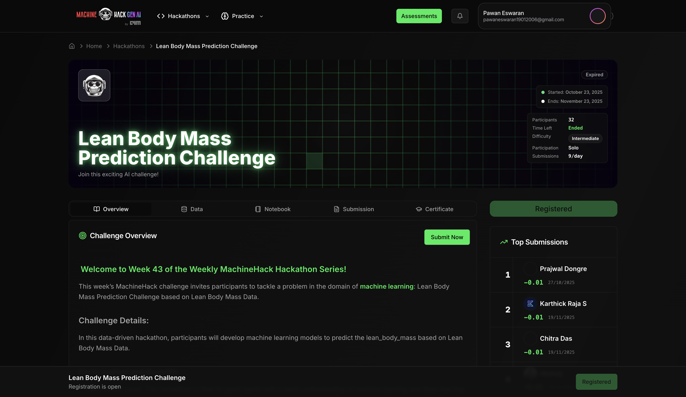
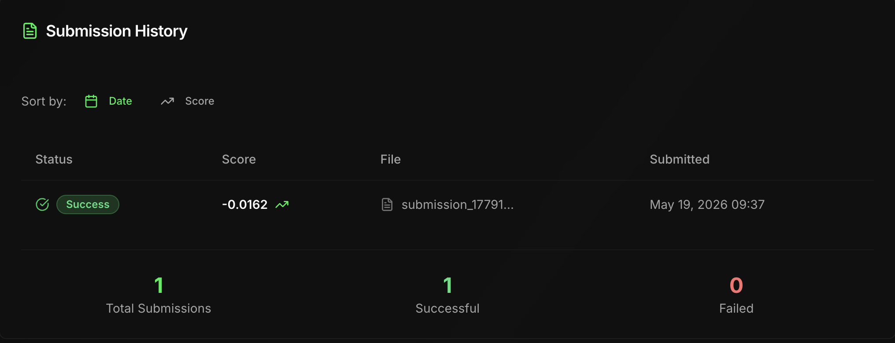

<div align="center">

# 💪 Lean Body Mass Prediction Challenge

<br>

<p align="center">
  
  
  
  
  
</p>

<p align="center">
  
  
</p>



</div>

---

# Table of Contents

- [Project Highlights](#-project-highlights)
- [Hackathon Achievement](#-hackathon-achievement)
- [Problem Statement](#-problem-statement)
- [Technologies Used](#-technologies-used)
- [Exploratory Data Analysis (EDA)](#-exploratory-data-analysis-eda)
  - [Key Observations](#key-observations)
- [Feature Engineering](#-feature-engineering)
  - [Engineered Features](#-engineered-features)
    - [1️⃣ Total Nutrients](#1️⃣-total-nutrients)
    - [2️⃣ Heart Rate Range](#2️⃣-heart-rate-range)
    - [3️⃣ Sodium Density](#3️⃣-sodium-density)
- [Data Preprocessing](#️-data-preprocessing)
- [Models Used](#-models-used)
- [Cross Validation](#-cross-validation)
- [Hyperparameter Tuning](#-hyperparameter-tuning)
  - [GridSearchCV](#gridsearchcv)
  - [RandomizedSearchCV](#randomizedsearchcv)
- [Feature Importance Analysis](#-feature-importance-analysis)
  - [Most Important Features](#most-important-features)
- [Performance Improvement Journey](#-performance-improvement-journey)
- [Key Learnings](#-key-learnings)
- [Project Structure](#-project-structure)
- [Final Conclusion](#-final-conclusion)

---

# 🚀 Project Highlights

✅ Performed complete end-to-end ML workflow  
✅ Conducted detailed Exploratory Data Analysis (EDA)  
✅ Applied advanced Feature Engineering techniques  
✅ Used Cross Validation for reliable evaluation  
✅ Performed Hyperparameter Tuning using:
- GridSearchCV
- RandomizedSearchCV

✅ Compared multiple regression models  
✅ Engineered ratio and density-based features  
✅ Improved model performance through iterative experimentation  
✅ Achieved **Top 2 leaderboard ranking**

---

# 🏆 Hackathon Achievement

🥈 **Rank Achieved:** #2  
📌 Competition: Lean Body Mass Prediction Challenge  
📈 Final Optimized Cross-Validation R² Score: **~ -0.0004**

---

# 📊 Problem Statement

The objective of this project was to predict:

```text
Lean Body Mass
```

using multiple nutritional and physiological features such as:
- Sugar Content
- Cholesterol Content
- Sodium Levels
- Water Intake
- Heart Rate Metrics
- Recipe Ratings
- Preparation Time
- Macronutrient Information

---

# 📚 Technologies Used

- Python
- NumPy
- Pandas
- Matplotlib
- Seaborn
- Scikit-learn
- XGBoost

---

# 🔍 Exploratory Data Analysis (EDA)

The dataset was explored using:
- Correlation Heatmaps
- Boxplots
- Distribution Analysis
- Histogram Visualization
- Outlier Analysis

### Key Observations

- Weak correlations with target variable
- Presence of skewed numerical distributions
- Significant redundancy among nutrient-related features
- Distributed weak signal across multiple features

---

# 🧠 Feature Engineering

Feature engineering played the MOST important role in improving model performance.

## ✅ Engineered Features

### 1️⃣ Total Nutrients

Combined:
- carbohydrates
- protein
- fat

into a single nutritional feature.

```python
total_nutrients = (
    carbs_amount
    + protein_amount
    + fat_amount
)
```

---

### 2️⃣ Heart Rate Range

Captured cardiovascular variation:

```python
heart_rate_range = (
    heart_rate_max
    - heart_rate_avg
)
```

---

### 3️⃣ Sodium Density

One of the highest-impact engineered features.

```python
sodium_density = (
    sodium_content_mg
    / portion_size
)
```

This normalized sodium concentration relative to serving size and significantly improved predictive performance.

---

# ⚙️ Data Preprocessing

Performed:
- Feature Scaling using `StandardScaler`
- Log Transformation using `np.log1p()`
- Redundant Feature Removal
- Train-Validation Splitting

---

# 🤖 Models Used

The following regression models were trained and evaluated:

| Model | Purpose |
|---|---|
| Linear Regression | Baseline model |
| Random Forest Regressor | Ensemble tree-based model |
| XGBoost Regressor | Advanced boosting model |

---

# 🔁 Cross Validation

Used:

```python
cross_val_score()
```

with:
- 5-Fold Cross Validation
- R² evaluation metric

to obtain reliable model performance estimates.

---

# 🔧 Hyperparameter Tuning

## GridSearchCV

Used to systematically search optimal:
- learning rate
- tree depth
- estimator count

---

## RandomizedSearchCV

Used broader randomized parameter exploration for:
- subsample ratio
- feature sampling
- regularization parameters

---

# 📈 Feature Importance Analysis

Feature importance analysis was performed using XGBoost to identify the strongest predictive signals.

### Most Important Features

- Recipe Rating
- Total Nutrients
- Sodium Density
- Heart Rate Range

---

# 📉 Performance Improvement Journey

| Stage | CV R² Score |
|---|---|
| Initial XGBoost | -0.133 |
| After Hyperparameter Tuning | -0.00092 |
| After Feature Engineering | -0.0007 |
| Final Optimized Pipeline | **~ -0.0004** |


---

# 🧪 Key Learnings

This project provided hands-on experience with:

✅ Feature Engineering  
✅ Weak-Signal Regression Problems  
✅ Model Generalization  
✅ Hyperparameter Optimization  
✅ Cross Validation  
✅ Feature Importance Interpretation  
✅ Iterative ML Experimentation  
✅ Real-world ML Workflow

---

# 📂 Project Structure

```text
Lean-Body-Mass-Prediction/
│
├── notebook.ipynb
├── Train.csv
├── Test.csv
├── submission.csv
├── requirements.txt
└── README.md
```

---

# 🔥 Final Conclusion

This project demonstrated how:
- meaningful feature engineering,
- proper validation strategies,
- and systematic experimentation

can significantly improve model performance even on difficult weak-signal datasets.
